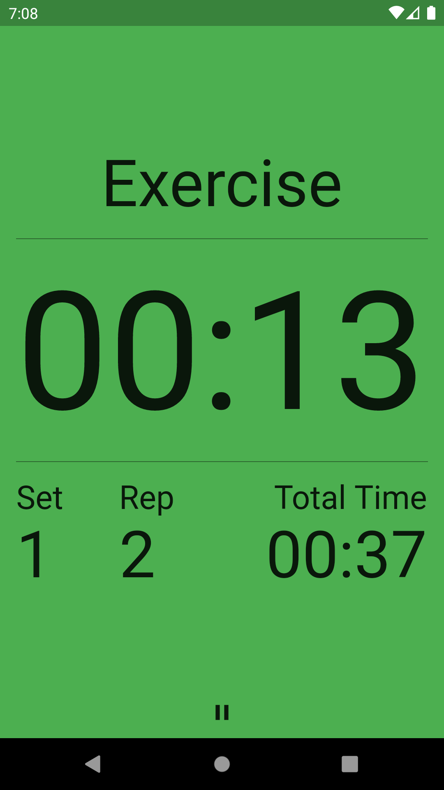
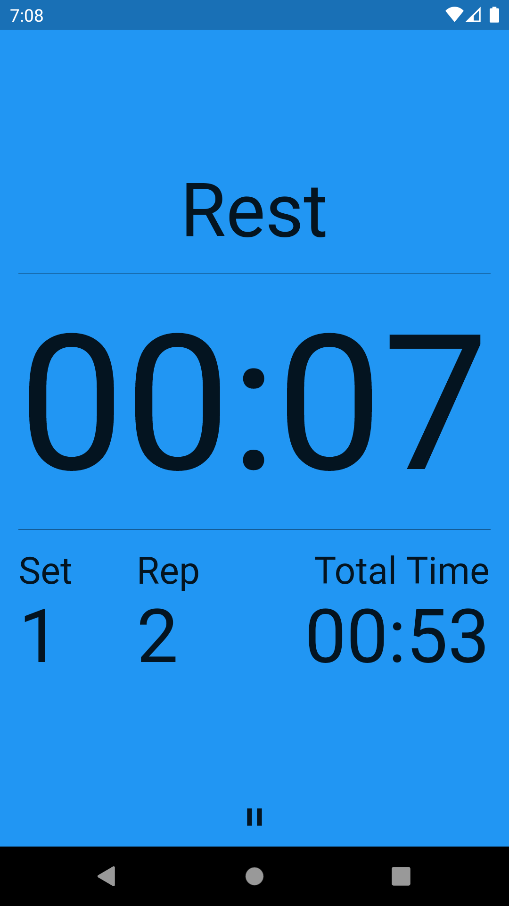
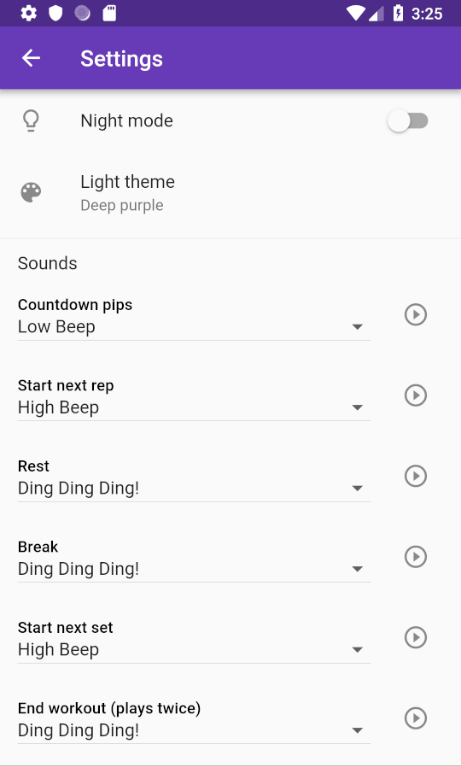
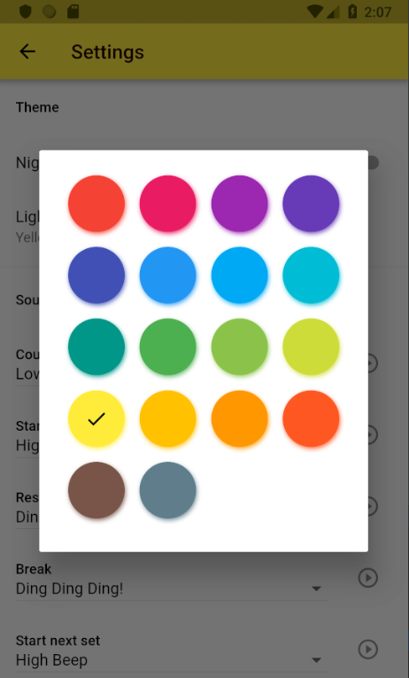
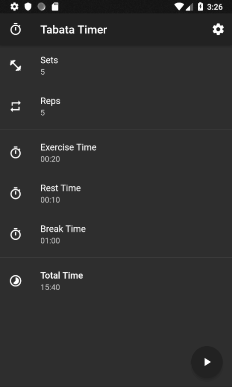
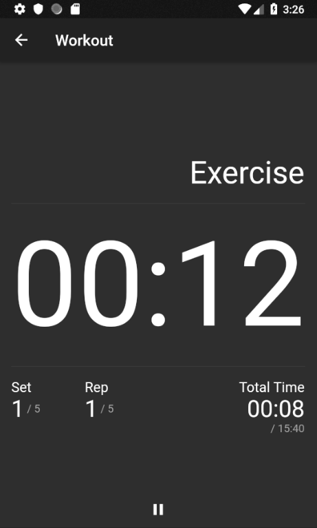

# Tabata Timer

A Tabata training interval timer written with Flutter.

You can try an online demo here: https://insin.github.io/tabata_timer

> **Note:** sound doesn't work in the demo as the audio library the app uses doesn't work on the web

## Screenshots

| Workout settings | Excercise period | Rest period |
| ---------------- | ---------------- | ----------- |
|  |  | 

| App settings | Light mode theme selection |
| ------------ | -------------------------- |
|  |  |

| Night mode | Night mode workout |
| ---------- | ------------------ |
|  |  |